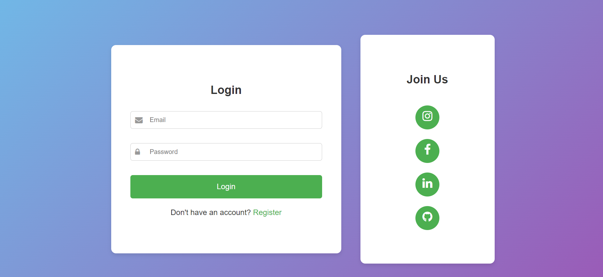
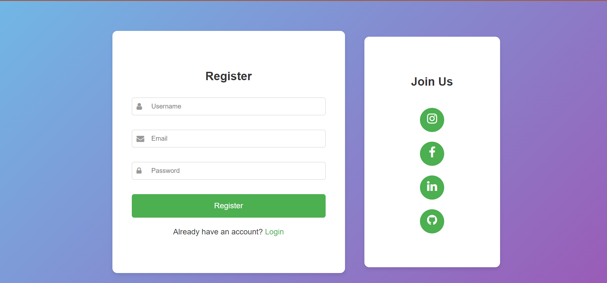
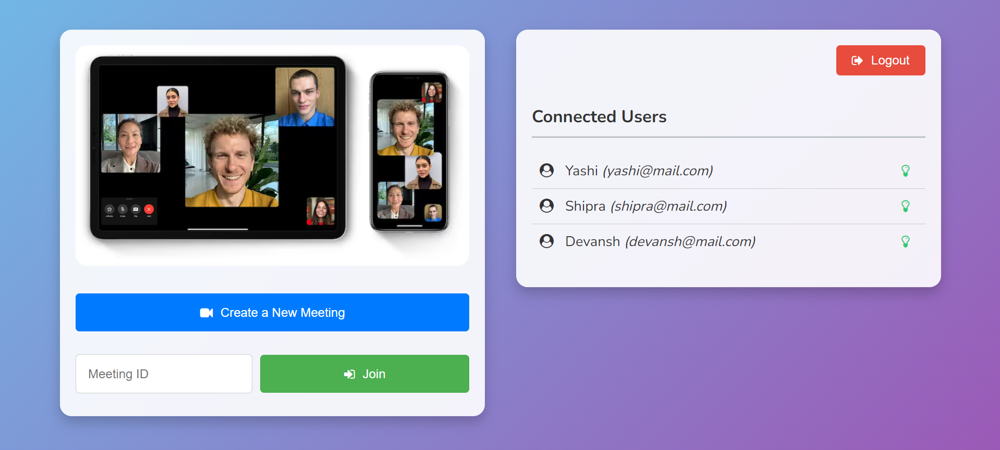
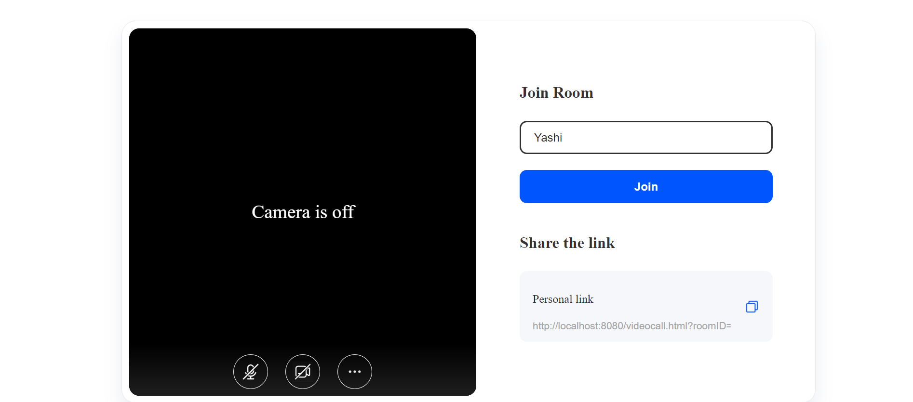

To use this project first of all make the clone of this repository on your local system

Rename application.properties.demo to application.properties and change the values of keys according to your db configuration

Create an account on zego cloud using link - www.zegocloud.com
change appID and serverSecret accordingly inside videocall.html file

Run the SpringBoot project and enjoy.

